# Welcome to Impresso Espresso

## ~ Your new local coffee shop website! ~

 

### Live production site available [here](https://impresso-expresso.netlify.app/)!

 

### The Stack

- Programming Language - JavaScript
- Frontend - React & Styled Components
- Framework - Gatsby
- Backend - GraphQL
- Data Management - Contentful
- Shopping Cart - Snipcart
- Contact Form - Formspree.io
- Styling - Bootstrap & CSS
- Hosting - Netlify

 

### This project was build to mimic an actual coffee shop website with features that include, customer reviews, menu items, products for purchase, about the company and a contact form.

 

### This is the homepage, filled with what's going on at Impresso Espresso, customer reviews and some chalk board images of the coffee drinks available.

 

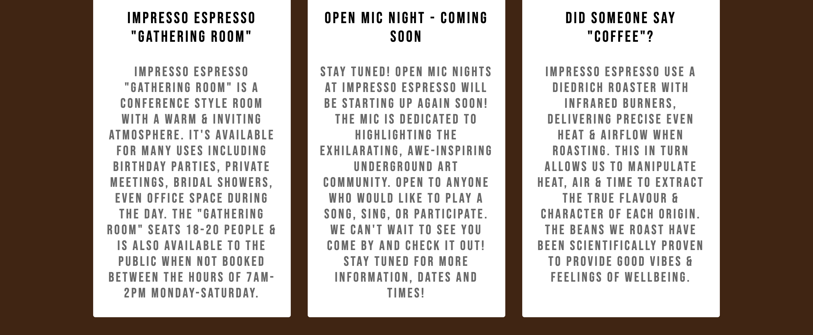

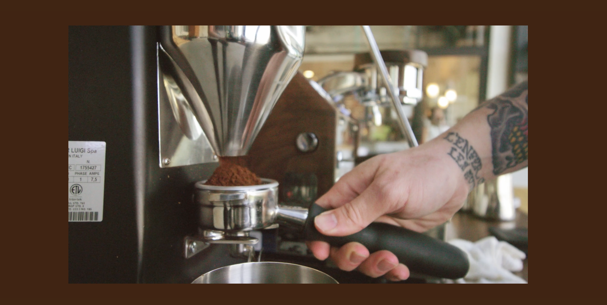

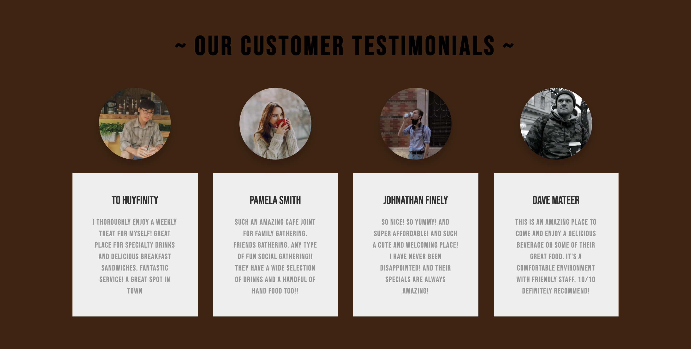

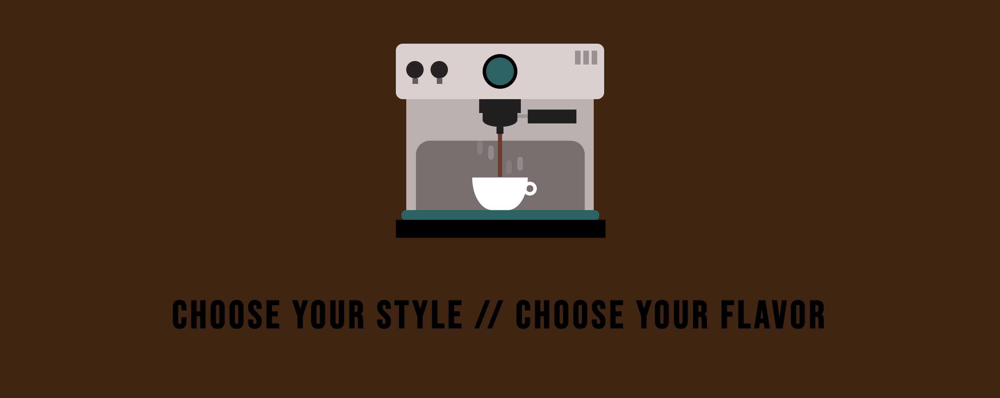
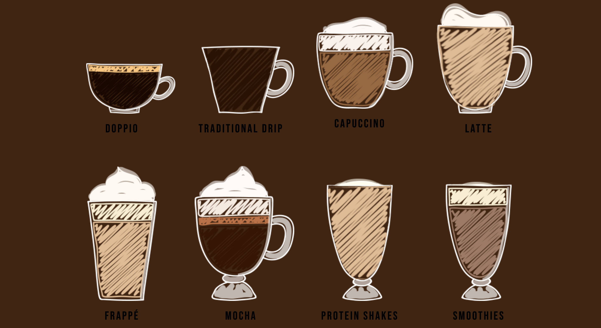

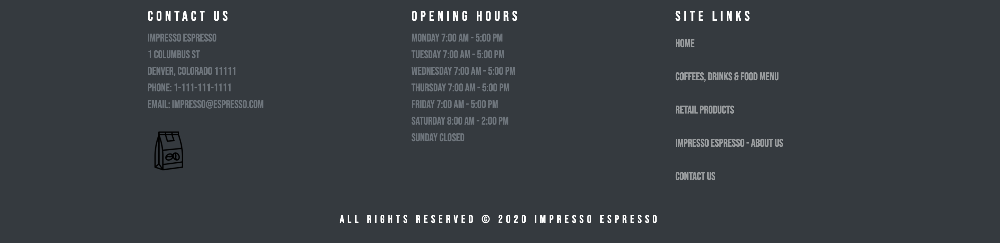

 

### Let's dive into the menu page! With the menu page you can easily filter through the different menu items by clicking, coffee, pastry, burrito, etc.. Each menu item is display with a picture, title, description as well as a price.

 

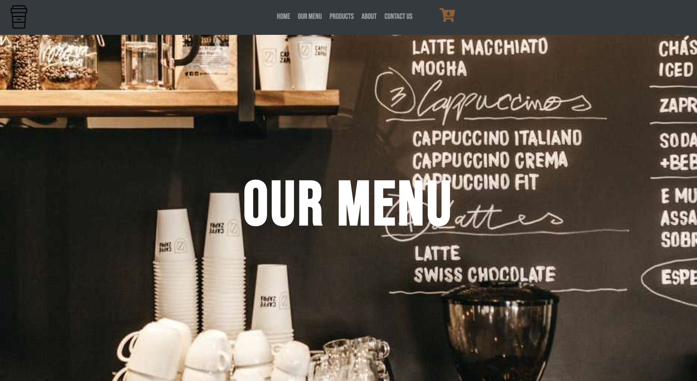

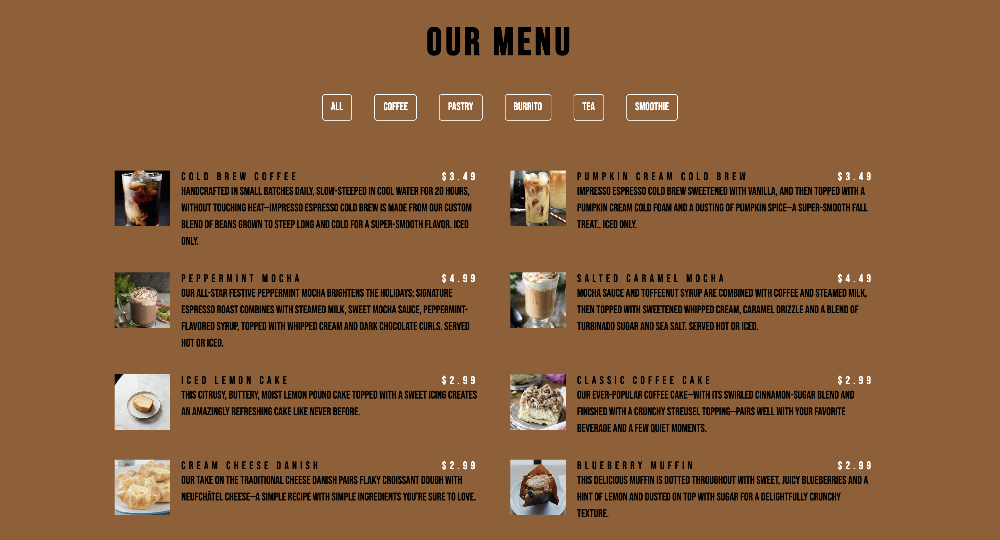

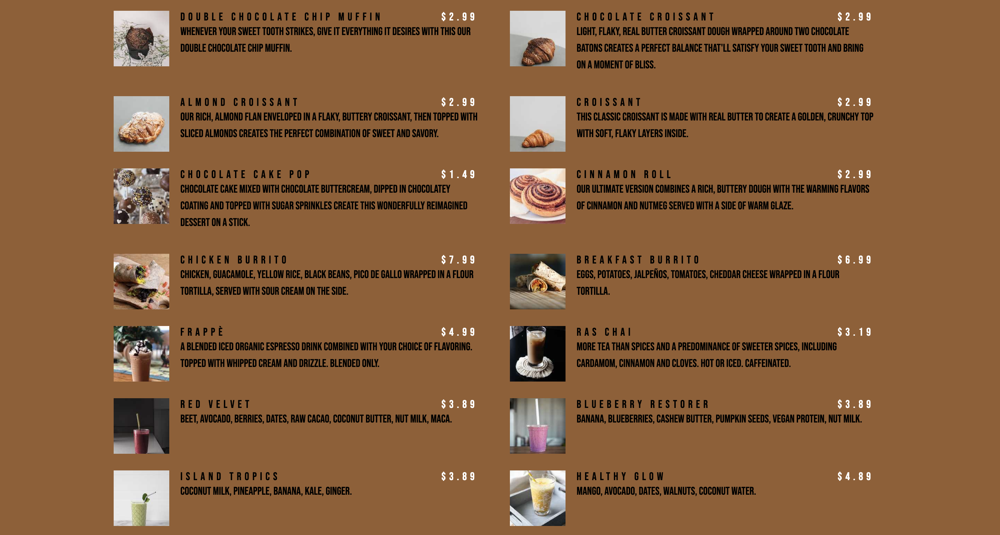

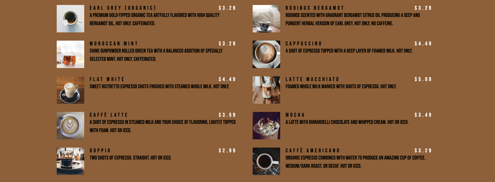

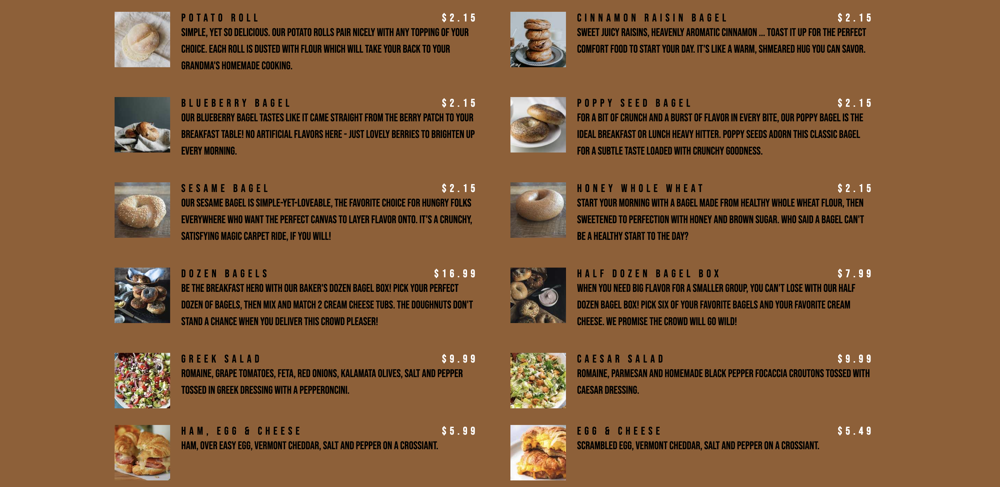

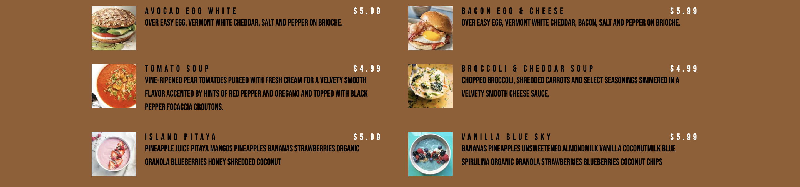

 

### The products page displays available items that are available for purchase, which you can complete that purchase using the snipcart shopping cart! Each product is displayed with a picture, title and a price.

 

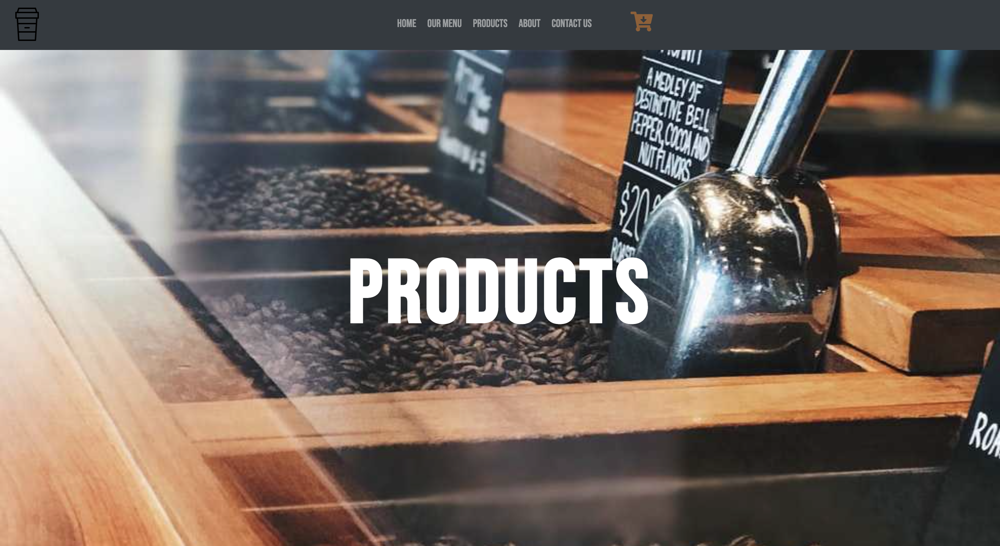

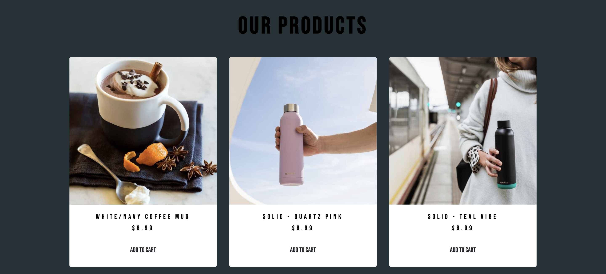

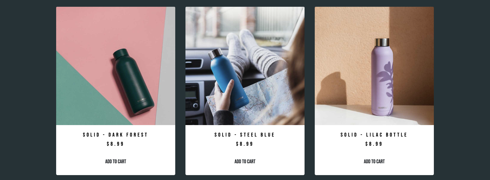

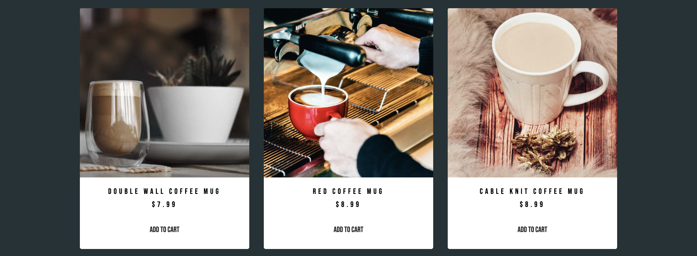

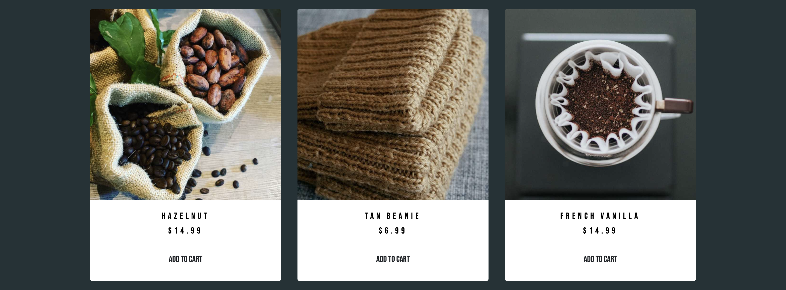

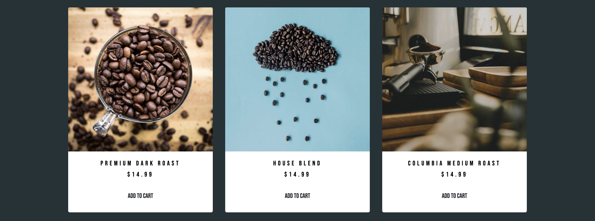

 

### In the about page, we go into detail about Impresso Espresso's mission on serving customers excellent quality coffee!

 

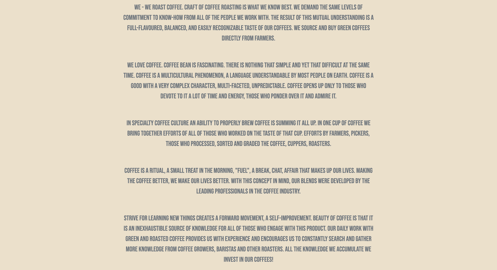

 

### On the contact page the user will be able to fill out the contact form, that can be used for questions, reservations, or feedback that will be sent to the Impresso Espresso team.

 

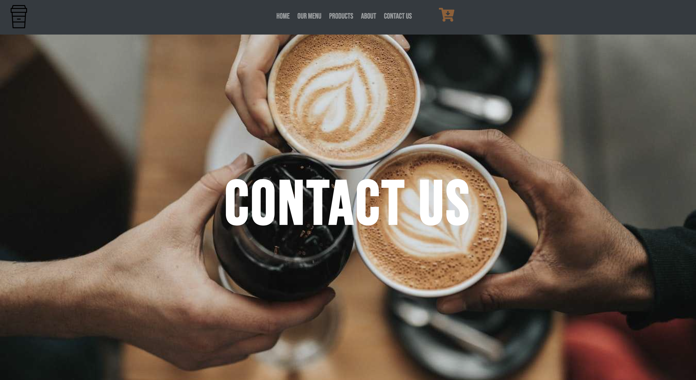

